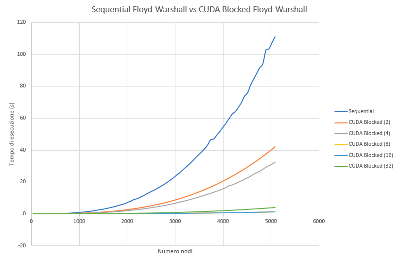
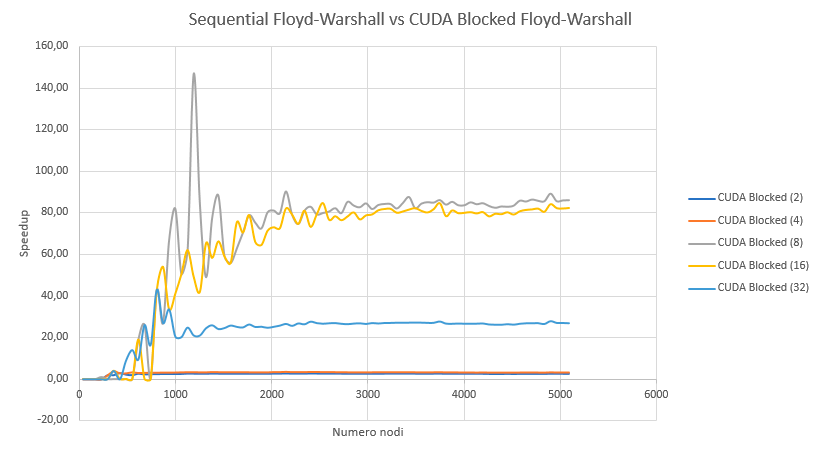
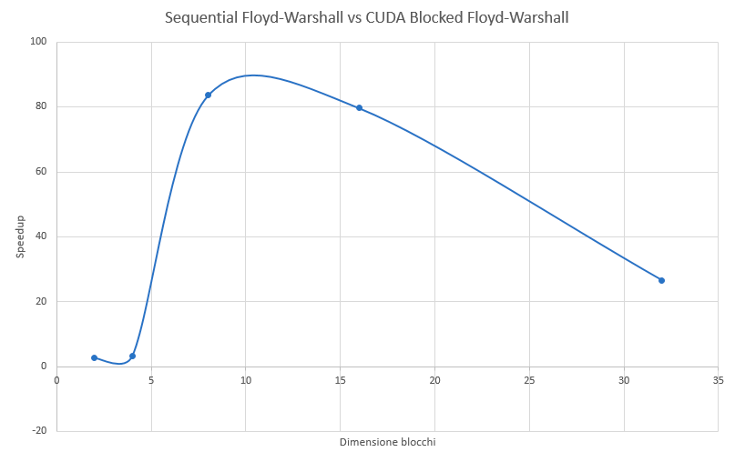
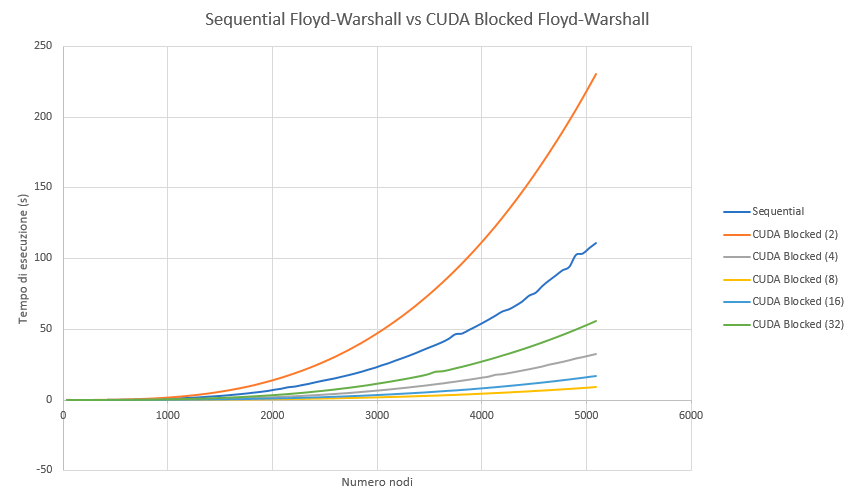
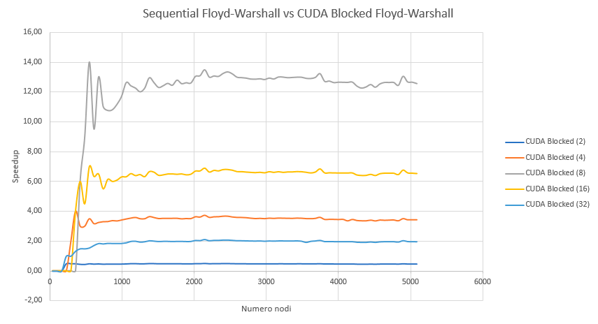
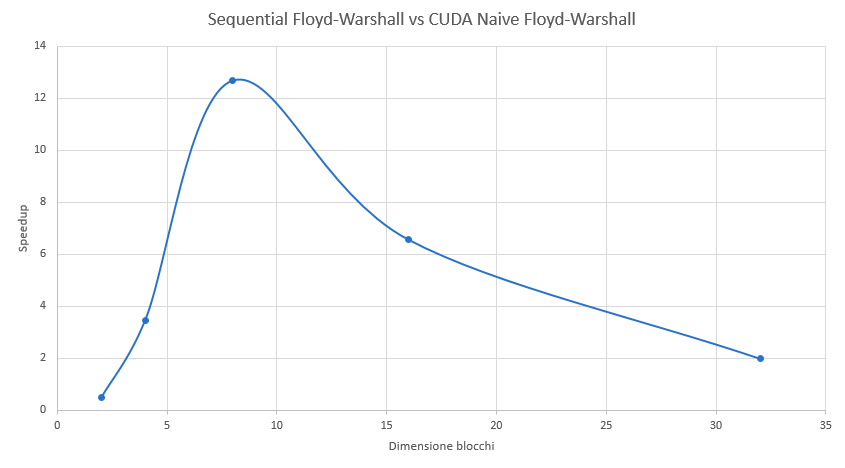

The [Floyd-Warshall algorithm](https://en.wikipedia.org/wiki/Floyd%E2%80%93Warshall_algorithm) is a well-known algorithm for the resolution of the *"All Pairs Shortest Path"* (aka **APSP**) problem, i.e. the calculation of the shortest path between all the pairs of nodes of a weighted and oriented graph. It has many practical applications, especially in the field of telecommunications and networks, where, for example, it is used for the calculation of optimal packet routing; but not only, other common applications include the inversion of real matrices ([Gauss-Jordan algorithm](https://en.wikipedia.org/wiki/Gaussian_elimination)), the computation of the similarity between graphs and regular expressions ([Kleene algorithm](https://en.wikipedia.org/wiki/Kleene%27s_algorithm), a generalization closely related to the Floyd-Warshall algorithm).

The aim of this project is to provide a parallel version of the algorithm and, specifically, a GPGPU implementation via CUDA, an hardware architecture for parallel processing on NVIDIA GPUs.


# Project structure
There are three main sections:
- *benchmark*: contains some utility functions needed to compare the performances of the different implementations of the algorithm.
- *lib*: contains a [sequential implementation](lib/floyd_warshall_sequential.c) of the Floyd-Warshall algorithm and two CUDA implementations, a [naive](lib/blocked_floyd_warshall_cuda_naive.cu) one and a [fully-optimized](lib/blocked_floyd_warshall_cuda.cu) one.
- *test*: contains some unit tests.

# Setup
- Clone the repository
- Make sure CUDA is installed on your system, on Debian-based distributions you can install it with:
```
sudo apt update
sudo apt install nvidia-cuda-toolkit
```


# Usage
Benchmarks are performed on randomly generated graphs, with a number of initial nodes equal to 32, up to a final graph of 1024 nodes with a step of 16 nodes from one configuration to another.
Obviously these parameters are configurable.

- Sequential: 
```
make bench_sequential [FROM_N=] [TO_N=] [STEP=]
```

- Naive CUDA: 
```
make bench_naive_cuda [FROM_N=] [TO_N=] [STEP=] [B=]
```

- Fully-optimized CUDA: 
```
make bench_cuda [FROM_N=] [TO_N=] [STEP=] [B=]
```

Where:
- `FROM_N` is the initial number of nodes of the graph
- `TO_N` is the final number of nodes of the graph
- `STEP` is the step (number of nodes) from one configuration to another
- `B` is the CUDA block sizes (BxB).

Results are printed to STDOUT with the following format: `"%d\t%f\n"`, `%d` is the number of nodes and `%f` the elapsed time.

# Results
Following are some results obtained on an MX150, a medium-low range GPU and on a Tesla P100, a high-end GPU.

## Sequential VS Fully-optimized CUDA (Tesla P100)



> "Numero nodi" means "Number of nodes"

> "Tempo di esecuzione" means "Elapsed time"





> "Dimensione blocchi" means "Block sizes"

## Sequential VS Fully-optimized CUDA (MX150)







---

In conclusion, as we can see from the images above, average speedups of **12x** (MX150) and **83x** (Tesla P100) were achieved. Well... That's impressive! :sweat_smile: